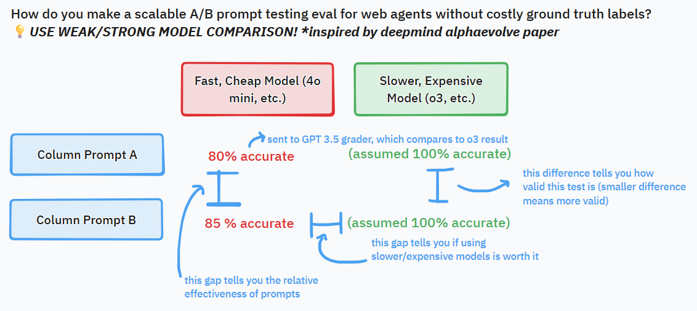

# Agentic Spreadsheet

**Excel on steroids.** An AI-native spreadsheet app where every data imputation is done by OpenAI web agents. Try it out: [agenticsheets.vercel.app](https://agenticsheets.vercel.app)

## Features

- **AI-Powered Data Generation**: Every cell can be populated by AI agents using the 4o-mini model with web search capabilities
- **Turbo Generation**: Queue generations for all empty cells in a column with a single click
- **Source Citations**: All AI-generated content includes citations to source material
- **A/B Testing Framework**: Test different column prompts through a scalable evaluation framework
- **Model Routing**: Manual or evaluation-informed model selection
- **Modern UI**: Clean, dark-mode interface built with Next.js and Tailwind CSS

## Tech Stack

- Next.js
- React
- TypeScript
- Tailwind CSS
- OpenAI API for Web Agents

## Evaluation Framework (inspired by Google Deepmind's Alpha Evolve Paper)

